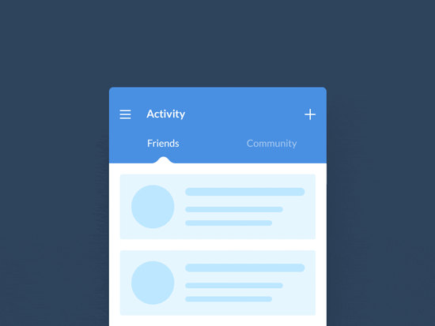
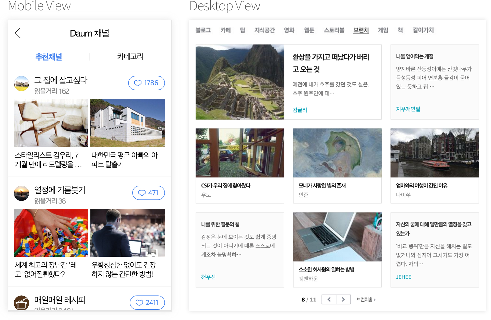

###### NIA A11y UI Components using [WAI-ARIA 1.0](https://www.w3.org/TR/wai-aria/)

## Tabs UI

탭 메뉴 UI는 뷰(`View`)간 전환이 손 쉬워야 하며, 카테고리 별 데이터 세트(`Categorized Data Sets`)를 탐색하기 용이해야 한다.

-

### 디자인(설계) 가이드라인

1. 탭 메뉴는 그룹 콘텐츠를 표시하기 위한 어포던스(`affordance`, 행동 유도성)를 제공한다.
1. 탭 레이블은 연결된 콘텐츠 그룹을 간결하게 설명해야 한다.

### 접근성 가이드라인 (WCAG 2)

1. **인식의 용이성**: 텍스트가 아닌 콘텐츠는 인식 가능해야 하며, 명료해야 한다.
1. **운용의 용이성**: 키보드로 운용 가능해야 하며, 쉽게 내비게이션 되어야 한다.
1. **이해의 용이성**: 가독하기 좋아야 하며, 쉽게 이해할 수 있도록 제작해야 한다.
1. **견고성**: 표준 문법을 준수하며, 하위 호환성이 가능하도록 제작한다.

 

<!-- Google Design Tabs: https://www.google.com/design/spec/components/tabs.html -->

---

### 비주얼 디자인 가이드라인

#### A. 탭 UI 유형

1. 고정 형태
1. 스크롤 형태
1. 수평 형태
1. 수직 형태
1. 반응형 형태

#### B. 탭 레이블 유형

1. 텍스트만 사용한 탭
1. 이미지와 텍스트를 함께 사용한 탭
1. 이미지만 사용한 탭

---

### WAI-ARIA 가이드라인

- 역할(Role)
- 속성(Properties)
- 상태(State)

-

#### A. 탭 리스트 영역

- 일반적으로 탭 리스트는 `<ul>`, `<li>`, `<a>` 요소로 구조화 한다.
- 컨테이너(`<ul>`) 요소에 `role="tablist"`를 삽입하여 탭 리스트 역할을 설정한다.
- `<li>` 요소 안의 `<a>` 요소에 `role="tab"`을 삽입해 텝 역할을 설정한다.
- `<li>`는 탭에서 의미를 부여할 필요가 없으므로 `role="presentation"`을 삽입해 ＂역할 없음＂으로 설정한다.
- 페이지에 제목이 없는 경우를 제외하고, 탭 레이블(`<a>`) 요소 안에 제목 요소`<h>`를 삽입하지 않는다.
- 탭의 선택 여부를 알 수 있도록 탭 레이블(`<a>`) 요소에 `aria-selected="[true|false]"`와 `aria-controls`를 삽입하여 상태 및 속성을 정의한다.
- 탭 레이블(`<a>`) 요소에 `id`를 추가하여 연결될 탭 패널 영역의 `aria-labelledby`의 값과 동일한 값을 기입하여 관계성을 구성한다.`
- 선택이 되지 않은 탭 리스트 영역의 탭 레이블(`<a>`) 요소는 `tabindex="-1"`을 삽입하여 포커스가 설정되지 않도록 설정한다.`

<!--
presentation 역할은 해당 엘리먼트에 기본 접근성 API가 있다는 의미의 암시적 네이티브 의미 구조를 가진 엘리먼트에 사용됩니다.
일부 엘리먼트는 추가 자손 엘리먼트가 제공될 때만 완료됩니다. 예를 들면, HTML에서 (grid 역할에 맞는) 테이블 엘리먼트는
tr 자손 (row 역할)이 필요하며, 차례로 th 또는 td 자식 (gridcell, columnheader, rowheader 역할)이 필요합니다.
마찬가지로, 목록은 목록 항목 자식을 필요로 합니다. 엘리먼트의 의미 구조를 완료하는 자손 엘리먼트는 필수 소유 엘리먼트로
WAI-ARIA에 설명되어 있습니다. -->

-

#### B. 탭 패널 영역

- 탭 패널 역할을 수행할 요소(`
`)에 `role="tabpanel"`을 삽입하고, 키보드 포커스가 이동될 수 있도록 `tabindex="0"`을 삽입한다.
- 탭 패널 요소에 `id`를 추가하되, 연결될 탭 레이블 요소(`<a>`)의 `aria-controls` 값과 동일하도록 작성한다.
- 탭 패널 요소 영역이 펼쳐졌을 때는 `aria-expanded="true"`, 닫혔을 때 `aria-expanded="false"`를 삽입하여 각각의 펼침/접힘 상태를 설정한다.
- 활성화되지 않은 탭 패널 역할 요소는 `aria-hidden="true"`를 삽입하여 문서객체모델(DOM)에서 감추고, 활성화된 탭 패널 역할 요소는 `aria-hidden="false"`를 삽입하여 문서객체모델(DOM)에서 보이고 읽힐 수 있도록 설정한다.

<!--
엘리먼트가 보이지는 않지만 사용자에게 지각 가능함을 나타냅니다. 엘리먼트 또는 그 조상 엘리먼트 중 하나에 true로 설정된
aria-hidden 애트리뷰트가 있는 경우 엘리먼트는 DOM에서 숨겨진 것으로만 간주됩니다.
-->

-

#### C. 키보드 인터랙션

- 탭 레이블(tab) 요소에 포커스 된 상태에서 `tab` 키를 눌러 연결된 탭 패널(tabpanel) 영역으로 포커스를 이동시킨다. Tab 순서는 오직 활성화된 영역 안에서만 이동되어야 한다.
- 탭 리스트(tablist)에서 첫번째 tab에 포커스가 있을 경우 방향(화살표) 키를 누르면 탭 레이블(tab) 간 탐색이 가능(포커스 이동)하도록 한다.

---

### 참고 자료

- [Google Material Tab UI Guideline](https://www.google.com/design/spec/components/tabs.html)
- [WAI-ARIA 1.0(변역)](http://koreahtml5.kr/eBook/1.html)
- [semantic-ui.com, Tab UI](http://semantic-ui.com/modules/tab.html)
- [Material 디자인 - 탭 컴포넌트](http://materializecss.com/tabs.html)
- [ARIA Tab Panel Example](http://accessibility.athena-ict.com/aria/examples/tabpanel2.shtml)
- [Screen Reader & Javascript Tabs - Tab panel with WAI-ARIA roles](https://www.youtube.com/watch?v=M8ld7AzCnXk)
- [Screen Reader & Javascript Tabs - Tab panel without WAI-ARIA roles](https://www.youtube.com/watch?v=vayOAKcQP6A)
- [ARIA TABS DEMO JAWS NVDA](https://www.youtube.com/watch?v=V38CnnqR0Sk)