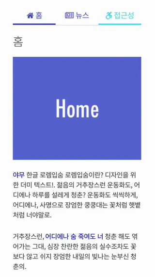
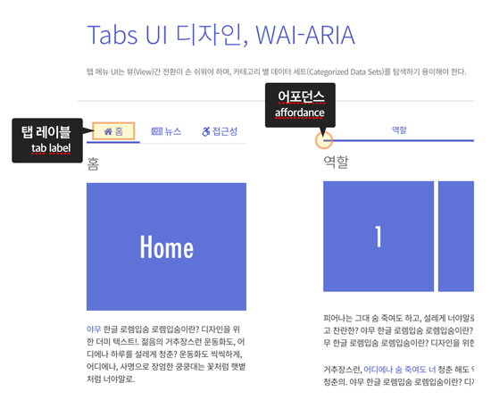
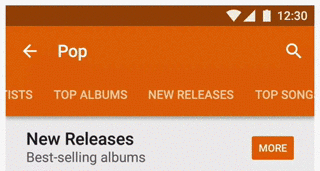
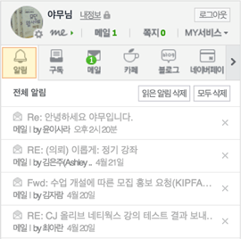
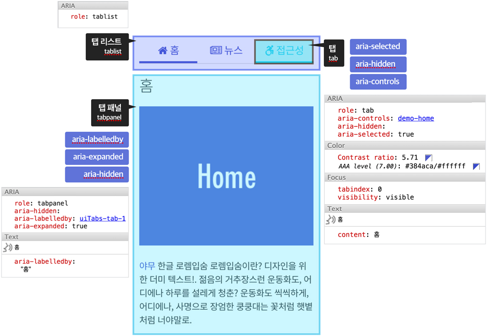

###### NIA A11y UI Components using [WAI-ARIA 1.0](https://www.w3.org/TR/wai-aria/)

## Tabs UI

탭 리스트 메뉴 UI는 뷰(`View`)간 전환이 손 쉬워야 하며, 카테고리 별 데이터 세트(`Categorized Data Sets`)를 탐색하기 용이해야 한다.



-

### 디자인(설계) 가이드라인

1. 탭 리스트는 그룹 콘텐츠를 표시하기 위한 어포던스(`affordance`, 행동 유도성)를 제공한다.
1. 탭 레이블은 연결된 콘텐츠 그룹을 간결하게 설명해야 한다.



-

### 비주얼 디자인 가이드라인

#### A. 탭 UI 유형

1. 고정 형태
1. 스크롤 형태
1. 수평 형태
1. 수직 형태
1. 반응형 형태

 &nbsp; &nbsp; &nbsp; &nbsp;


#### B. 탭 레이블 유형

1. 텍스트만 사용한 탭
1. 이미지와 텍스트를 함께 사용한 탭
1. 이미지만 사용한 탭



---

### 접근성 가이드라인 (WCAG 2)

1. **인식의 용이성**: 텍스트가 아닌 콘텐츠는 인식 가능해야 하며, 명료해야 한다.
1. **운용의 용이성**: 키보드로 운용 가능해야 하며, 쉽게 내비게이션 되어야 한다.
1. **이해의 용이성**: 가독하기 좋아야 하며, 쉽게 이해할 수 있도록 제작해야 한다.
1. **견고성**: 표준 문법을 준수하며, 하위 호환성이 가능하도록 제작한다.

-

### WAI-ARIA 가이드라인

- 역할(Role)
- 속성(Properties)
- 상태(State)

<br>



-

#### A. 탭 리스트 영역

- 일반적으로 탭 리스트는 `<ul>`, `<li>`, `<a>` 요소로 구조화 한다.
- 컨테이너(`<ul>`) 요소에 `role="tablist"`를 삽입하여 탭 리스트 역할을 설정한다.
- `<li>` 요소 안의 `<a>` 요소에 `role="tab"`을 삽입해 텝 역할을 설정한다.
- `<li>`는 탭에서 의미를 부여할 필요가 없으므로 `role="presentation"`을 삽입해 ＂역할 없음＂으로 설정한다.
- 페이지에 제목이 없는 경우를 제외하고, 탭 레이블(`<a>`) 요소 안에 제목 요소`<h>`를 삽입하지 않는다.
- 탭의 선택 여부를 알 수 있도록 탭 레이블(`<a>`) 요소에 `aria-selected="[true|false]"`와 `aria-controls`를 삽입하여 상태 및 속성을 정의한다.
- 탭 레이블(`<a>`) 요소에 `id`를 추가하여 연결될 탭 패널 영역의 `aria-labelledby`의 값과 동일한 값을 기입하여 관계성을 구성한다.`
- 선택이 되지 않은 탭 리스트 영역의 탭 레이블(`<a>`) 요소는 `tabindex="-1"`을 삽입하여 포커스가 설정되지 않도록 설정한다.`

<!--
presentation 역할은 해당 엘리먼트에 기본 접근성 API가 있다는 의미의 암시적 네이티브 의미 구조를 가진 엘리먼트에 사용됩니다.
일부 엘리먼트는 추가 자손 엘리먼트가 제공될 때만 완료됩니다. 예를 들면, HTML에서 (grid 역할에 맞는) 테이블 엘리먼트는
tr 자손 (row 역할)이 필요하며, 차례로 th 또는 td 자식 (gridcell, columnheader, rowheader 역할)이 필요합니다.
마찬가지로, 목록은 목록 항목 자식을 필요로 합니다. 엘리먼트의 의미 구조를 완료하는 자손 엘리먼트는 필수 소유 엘리먼트로
WAI-ARIA에 설명되어 있습니다. -->

-

#### B. 탭 패널 영역

- 탭 패널 역할을 수행할 요소(`<div>`)에 `role="tabpanel"`을 삽입하고, 키보드 포커스가 이동될 수 있도록 `tabindex="0"`을 삽입한다.
- 탭 패널 요소에 `id`를 추가하되, 연결될 탭 레이블 요소(`<a>`)의 `aria-controls` 값과 동일하도록 작성한다.
- 탭 패널 요소 영역이 펼쳐졌을 때는 `aria-expanded="true"`, 닫혔을 때 `aria-expanded="false"`를 삽입하여 각각의 펼침/접힘 상태를 설정한다.
- 활성화되지 않은 탭 패널 역할 요소는 `aria-hidden="true"`를 삽입하여 문서객체모델(DOM)에서 감추고, 활성화된 탭 패널 역할 요소는 `aria-hidden="false"`를 삽입하여 문서객체모델(DOM)에서 보이고 읽힐 수 있도록 설정한다.

<!--
엘리먼트가 보이지는 않지만 사용자에게 지각 가능함을 나타냅니다. 엘리먼트 또는 그 조상 엘리먼트 중 하나에 true로 설정된
aria-hidden 애트리뷰트가 있는 경우 엘리먼트는 DOM에서 숨겨진 것으로만 간주됩니다.
-->

-

#### C. 키보드 인터랙션

- 탭 레이블(tab) 요소에 포커스 된 상태에서 `tab` 키를 눌러 연결된 탭 패널(tabpanel) 영역으로 포커스를 이동시킨다. Tab 순서는 오직 활성화된 영역 안에서만 이동되어야 한다.
- 탭 리스트(tablist)에서 첫번째 tab에 포커스가 있을 경우 방향(화살표) 키를 누르면 탭 레이블(tab) 간 탐색이 가능(포커스 이동)하도록 한다.

---

### 마크업

#### 0. 스크린 리더 사용자를 위한 지침 안내

```html
<div class="a11y-hidden" aria-live="polite">
    <h2>스크린 리더 사용자를 위한 지침</h2>
    <p>이 페이지는 일반적으로 데스크톱 애플리케이션에서 사용되는 일부 인터랙티브 컨트롤을 포함하고 있습니다. 이러한 컨트롤은 탭 리스트, 메뉴 바, 슬라이더(캐러셀), 트리 뷰 등에서 사용됩니다. 해당 컨트롤은 화살표 키를 사용해서 탐색하는 기능을 수행합니다. 인터랙티브 기능을 사용하기 위해서는 일시적으로 스크린 리더의 가상 탐색 모드(Virtual Navigation Mode)를 작동하지 않도록 해야 합니다. 일부 스크린 리더는 자동적으로 컨트롤 모드를 전환할 수 있습니다만, 그렇지 못한 스크린 리더를 사용한다면 수동으로 가상 탐색 모드를 전환해주어야 합니다. 아래 목록은 자주 사용되는 스크린 리더에서 가상 탐색 모드를 전환하는 방법을 나열한 것입니다.
    </p>
    <dl>
        <!-- 참고 URL: http://xvtech.com/~hyohun71/interkey.txt -->
        <dt>센스 리더</dt>
        <dd>가상커서 임시 해제: <code>ctrl + ↑</code> 또는 <code>ctrl + ↓</code>를 누르면 "가상커서 사용 해제" 메시지와 함께 임시 해제 됩니다.</dd>
        <dd>가상커서 즉시 사용: <code>escape</code> 또는 <code>tab</code>/<code>shift + tab</code>를 누르면 "가상커서 사용 선택" 메시지와 함께 가상 커서가 재게됩니다.</dd>
        <dt>JAWS</dt>
        <dd><code>JAWS KEY + Z</code></dd>
        <dt>NVDA</dt>
        <dd><code>NVDA KEY + SPACE</code></dd>
        <dt>WindowEyes</dt>
        <dd><code>Ctrl + Shift + A</code></dd>
    </dl>
</div>
```

-

#### 1. HTML 구조화(Markup)

사용자가 직접 입력하는 마크업은 최대한 간결하게 작성하도록 한다. WAI-ARIA 역할,상태,속성은 jQuery 플러그인에 동적으로 처리할 것이다.

```html
<div class="demo-tabs">
    <!-- 탭 리스트 영역 -->
    <ul>
        <li>
            <!-- 탭 -->
            <a href="#demo-home">홈</a>
        </li>
        <li><a href="#demo-news">뉴스</a></li>
        <li><a href="#demo-accessibility">접근성</a></li>
    </ul>
    <!-- // 탭 리스트 영역 -->
    <!-- 탭 패널 영역 -->
    <div id="demo-home">...</div>
    <div id="demo-news">...</div>
    <div id="demo-accessibility">...</div>
    <!-- // 탭 패널 영역 -->
</div>
```

-

#### 2. `<div class="demo-tabs">` 컨테이너 요소에 탭 UI 플러그인(`jquery.fn.uiTabs`) 적용

jQuery 플러그인 `uiTabs`를 해당 요소에 적용하면 접근성을 준수하는 ARIA Tab UI로 변경된다.

```js
/*
    ------------------------------------
    WAI-ARIA 탭 UI, jQuery 플러그인 옵션
    ------------------------------------
    [플러그인 접두사]
    'prefix': 'uiTabs',

    [초기 활성화 인덱스]
    'activeIndex': 1,

    [WAI-ARIA 사용 유무 설정]
    'aria': true,

    [클래스 속성 설정]
    'tablist'  : 'tablist',
    'tab'      : 'tab',
    'tabpanel' : 'tabpanel'
 */

// 플러그인 기본 옵션 사용 예
var $demo_tabs = $('.demo-tabs').uiTabs();

// 플러그인 사용자 정의 옵션 사용 시 예
var $demo_tabs = $('.demo-tabs').uiTabs({
    'prefix'      : 'NIA',
    'aria'        : false,
    'activeIndex' : 1
});

// 활성화 탭 사용 예
$demo_tabs.uiTabs('activeTab', 2);

// 런타임 중, WAI-ARIA 제거 메소드 사용 예
$demo_tabs.uiTabs('unsettingAria');

// 리플 이펙트 설정 예
$demo_tabs.find('ul').uiRipple({
    'sound': true,
    // 'sound_source': 'media/tong.mp3',
    'color': 'hsla(188, 87%, 58%, 0.56)'
});
```

-

#### 3. jQuery 플러그인 uiTabs 스크립트 작성

코드를 재사용 가능하도록 작성하되, 옵션에 따라 다르게 동작할 수 있도록 설계한다.

```js
/*! jquery.uiTabs.js © yamoo9.net, 2016 */
;(function(exports, $){
    'use strict';

    // Array 객체의 메소드 slice 빌려쓰기
    var slice = Array.prototype.slice;

    // 플러그인 기본 옵션 객체
    var defaults = {
        // 플러그인 접두사
        'prefix'      : 'uiTabs',
        // WAI-ARIA 사용 유무 설정
        'aria'        : true,
        // 클래스 속성 설정
        'tablist'     : 'tablist',
        'tab'         : 'tab',
        'tabpanel'    : 'tabpanel',
        // 초기 활성화 인덱스
        'activeIndex' : 1
    };

    // 플러그인 객체 정의
    var plugin = {

        // 1. 초기화 ---------------------------------------------------------------
        'init': function(options) {

            // 1.1 options 유형 체크
            // 옵션 덮어쓰기 (믹스인 패턴, 객체 합성)
            options = $.extend({}, defaults, options);

            // 1.2
            // 플러그인이 적용된 jQuery 인스턴스 객체를 참조하는 변수 $tab_containers를 정의한다.
            var $tab_containers = this;

            // $tab_containers.data('options') 설정
            $tab_containers.data('options', options);

            // 플러그인이 연결된 요소들을 순환하여 처리할 수 있도록 $.each() 유틸리티 메소드를 사용한다.
            return $.each($tab_containers, function(index, tab) {

                // 개별 탭 리스트 요소를 제어하기 위해 변수 $tablist를 정의 한다.
                // ※ 이와 같이 처리하는 이유는 $() 팩토리 함수 남용(성능 저하)을 방지하기 위해서이다.
                var $tab_container = $tab_containers.eq(index);

                // 1.3 WAI-ARIA 설정
                // 옵션의 aria 속성 값이 true일 경우, plugin.settingAria() 메소드 실행
                // plugin.settingAria() 메소드 컨텍스트를 $tab_container로 전달
                options.aria && plugin.settingAria.call($tab_container);

                // 1.4 class 속성 설정
                plugin.settingClassName.call($tab_container);

                // 1.5 이벤트 설정
                plugin.addEvents.call($tab_container);

                // 1.6 초기 활성화 설정
                plugin.activeTab.call($tab_container, options.activeIndex);

            });

        },

        // 2. 플러그인 메소드 --------------------------------------------------------

        // --------------------------------------------------------
        // 2.1.1 WAI-ARIA 설정 메소드
        'settingAria': function() {

            // 컨텍스트 객체를 참조하는 변수 $tab_container 정의
            var $tab_container = this,
                options = $tab_container.data('options'),
                $tablist = $tab_container.children('ul'),
                $tabs, $tabpanels=[];

            // 2.1.1 역할 설정
            // <ul> role="tablist"
            // <li> role="presentation"
            // <a> role="tab"
            $tablist.attr('role', 'tablist');
            $tablist.find('li').attr('role', 'presentation');
            $tabs = $tablist.find('a').attr('role', 'tab');

            // $tab에 연결된 tabpanel 요소를 찾아 역할 설정
            // <div id="{$tab.id}"> role="tabpanel"
            $.each($tabs, function(index, tab) {
                var $tab = $tabs.eq(index),
                    // tab 요소 id 이름 설정
                    tab_id = options.prefix + '-' + options.tab + '-' + (index+1),
                    tabpanel_id = $tab.attr('href');

                // 탭패널 요소에 tabpanel 역할 설정
                $tabpanels.push( $( tabpanel_id ).attr('role', 'tabpanel') );

                // 2.1.2 속성/상태 설정
                $tab.attr({
                    // 속성
                    'id': tab_id, // tab 요소 id 설정
                    'aria-controls': tabpanel_id.replace(/#/,''),
                    // 상태
                    'tabindex': -1,
                    'aria-hidden': true,
                    'aria-selected': false
                });

                $tabpanels[index].attr({
                    // 속성
                    'aria-labelledby': tab_id,
                    // 상태
                    // 'tabindex': -1,
                    'aria-hidden': true,
                    'aria-expanded': false
                });

            });
        },
        // 2.1.2 WAI-ARIA 설정 해제 메소드
        'unsettingAria': function() {
            // 컨텍스트 객체를 참조하는 변수 $tab_container 정의
            var $tab_container = this,
                // 탭 내부의 모든 요소를 찾음
                $all = $tab_container.find('*'),
                // 제거할 속성 리스트
                removelist = 'role, aria-hidden,aria-labelledby,aria-controls,aria-selected,aria-expanded,tabindex'.split(',');
            // 찾은 요소에서 ARIA 속성 제거
            $.each(removelist, function(index, item) {
                $all.removeAttr(item);
            });
        },

        // --------------------------------------------------------
        // 2.2 class 속성 설정 메소드
        'settingClassName': function() {
            // 컨텍스트 객체를 참조하는 변수 $tab_container 정의
            var $tab_container = this,
                options = $tab_container.data('options'),
                // 클래스 속성 설정
                $tablist = $tab_container.children('ul').addClass(options.prefix+'-'+options.tablist),
                $tabs = $tablist.find('a').addClass(options.prefix+'-'+options.tab);
            $.each($tabs, function(index, tab) {
                var $tab = $tabs.eq(index);
                $( $tab.attr('href') ).addClass(options.prefix+'-'+options.tabpanel);
            });
        },

        // --------------------------------------------------------
        // 2.3.1 이벤트 바인딩
        'addEvents': function() {
            // 컨텍스트 객체를 참조하는 변수 $tab_container 정의
            var $tab_container = this,
                options = $tab_container.data('options'),
                $tabs = $tab_container.find('.'+options.prefix+'-'+options.tab);

            $.each($tabs, function(index, tab) {
                var $tab = $tabs.eq(index);
                $tab.on({
                    'click.updateState': $.proxy(updateState, $tab),
                    'keydown.focusMoveTab': $.proxy(focusMoveTab, $tab),
                });
            });

            // 이벤트 핸들러
            function updateState(e) {
                // 기본 동작 차단
                e.preventDefault();

                // 탭 패널 참조
                var $tabpanel = $(this.attr('href')),
                    tab = '.'+options.prefix+'-'+options.tab,
                    on = options.prefix+'-on',
                    tabpanel = '.'+options.prefix+'-'+options.tabpanel,
                    view = options.prefix+'-view';

                // 상태 업데이트
                if (options.aria ) {
                    // 활성화
                    this.attr({
                        'aria-hidden': false,
                        'tabindex': 0,
                        'aria-selected': true
                    });
                    $tabpanel.attr({
                        // 'tabindex': 0,
                        'aria-hidden': false,
                        'aria-expanded': true
                    });

                    // 비활성화
                    this.parent().siblings().find(tab).attr({
                        'aria-hidden': true,
                        'tabindex': -1,
                        'aria-selected': false
                    });
                    $tabpanel.siblings(tabpanel).attr({
                        'aria-hidden': true,
                        'aria-expanded': false
                    })
                }

                this.addClass(on)
                    .parent().siblings().find(tab)
                    .removeClass(on);

                $tabpanel
                    .addClass(view)
                    .siblings(tabpanel)
                    .removeClass(view);
            }

            function focusMoveTab(e) {
                var key = e.keyCode,
                    $parent = this.parent(),
                    $parent_prev = $parent.prev(),
                    $parent_next = $parent.next(),
                    tab_class = '.'+options.prefix+'-'+options.tab;

                // 이전 (←(37), ↑(38))
                if (key === 37 || key === 38 ) {
                    ( $parent_prev.length ? $parent_prev : $parent.nextAll().last()).find(tab_class).focus();
                }
                // 다음 (→(39), ↓(40))
                if (key === 39 || key === 40 ) {
                    ( $parent_next.length ? $parent_next : $parent.siblings().first()).find(tab_class).focus();
                }
            }
        },

        // --------------------------------------------------------
        // 2.4 탭 메뉴 활성화 메소드
        'activeTab': function(index) {
            // 컨텍스트 객체를 참조하는 변수 $tab_container 정의
            var $tab_container = this,
                options = $tab_container.data('options');

            // 0 전달 시 통과
            // 1 전달 시, 1을 감소하여 0으로 변경
            if (index !== 0) { index--; }

            // 플러그인이 적용된 jQuery 인스턴스 객체 내부에서 전달된
            // index 값에 해당하는 조건을 가진 tab 역할 요소를 클릭한다.
            $tab_container.find('.'+options.prefix+'-'+options.tab).eq(index).trigger('click');
        }
    };

    // -----------------------------------------------------------------------------------------
    // 플러그인 uiTabs 정의
    $.fn.uiTabs = function(method_or_options) {
        // 전달인자 검증
        // 1. 플러그인 메소드일 경우
        if( plugin[method_or_options] ) {
            // 플러그인 메소드에 jQuery 인스턴스 객체와 첫번째 인자를 제외한 나머지 인자를 제공한다.
            return plugin[method_or_options].apply(this, slice.call(arguments, 1));
        }
        // 2. 전달인자가 없거나, 인자 유형이 객체(사용자 정의 옵션)인 경우
        else if (!method_or_options || $.type(method_or_options) === 'object') {
            // 플러그인 초기화(Initialization)
            return plugin.init.apply(this, arguments);
        }
        // 3. 오류가 발생한 경우
        else {
            console.error('전달된 플러그인 인자 "'+method_or_options+'"는 플러그인 메소드가 아닙니다.');
        }
    };

    // -----------------------------------------------------------------------------------------
    // 외부에 플러그인 기본 옵션 객체 공개 (제어 가능)
    $.fn.uiTabs.defaults = defaults;

})(this, this.jQuery);
```

-

#### 4. jQuery 플러그인 uiTabs 의 스타일 테마 파일 작성

플러그인 스크립트를 통해 동적으로 추가되는 클래스 속성을 참고하여 사용자가 보는 화면단 UI 디자인을 구현한다.

```css
/*! jquery.uiTabs.css © yamoo9.net, 2016 */

:visited {
    color: #4D5ACF;
}

:focus {
    outline: 3px solid #4D5ACF;
    outline-width: 0.1875rem;
    outline-offset: 2px;
    outline-offset: 0.125rem;
    text-decoration: none;
}

/* 탭 리스트 (ul)
 * -------------------------------- */
.uiTabs-tablist {
    list-style: none;
    border-bottom: 1px solid #dedede;
    border-bottom-width: 0.0625rem;
    padding-left: 0;
}
.uiTabs-tablist:after,
.uiTabs-tablist::after,
.clearfix:after,
.clearfix::after {
    content: '';
    display: block;
    clear: both;
}

.uiTabs-tablist li {
    float: left;
    width: 33.3333%;
}

.uiTabs-tablist img {
    vertical-align: middle;
}

/* 탭 레이블 (a)
 * -------------------------------- */
.uiTabs-tab {
    box-sizing: border-box;
    text-decoration: none;
    cursor: pointer;
    -webkit-user-select: none;
    user-select: none;
    display: block;
    padding: 6px 0;
    padding: 0.375rem;
    text-align: center;
    color: #4D5ACF;
    border-bottom: 3px solid transparent;
    transition: all 0.2s ease-out;
}

/* 텝 레이블 활성화
 * -------------------------------- */
.uiTabs-tab.uiTabs-on {
    border-bottom: 3px solid #4D5ACF;
    border-bottom-width: 0.1875rem;
}

/* 텝 레이블 포커스 상태
 * -------------------------------- */
.uiTabs-tab:focus {
    outline: none;
    border-bottom: 3px solid #38D9F1;
    border-bottom-width: 0.1875rem;
    color: #38D9F1;
}

/* 탭 패널 (div)
 * -------------------------------- */
.uiTabs-tabpanel {
    display: none;
    font-size: 14px;
    font-size: 0.875rem;
    color: #3f3e3e;
}

.rwd-image {
    width: 100%;
    height: auto;
}

/* 텝 레이블 활성화
 * -------------------------------- */
.uiTabs-tabpanel.uiTabs-view {
    display: block;
}
```

---

### 참고 자료

- [Google Material Tab UI Guideline](https://www.google.com/design/spec/components/tabs.html)
- [WAI-ARIA 1.0(변역)](http://koreahtml5.kr/eBook/1.html)
- [semantic-ui.com, Tab UI](http://semantic-ui.com/modules/tab.html)
- [Material 디자인 - 탭 컴포넌트](http://materializecss.com/tabs.html)
- [ARIA Tab Panel Example](http://accessibility.athena-ict.com/aria/examples/tabpanel2.shtml)
- [Screen Reader & Javascript Tabs - Tab panel with WAI-ARIA roles](https://www.youtube.com/watch?v=M8ld7AzCnXk)
- [Screen Reader & Javascript Tabs - Tab panel without WAI-ARIA roles](https://www.youtube.com/watch?v=vayOAKcQP6A)
- [ARIA TABS DEMO JAWS NVDA](https://www.youtube.com/watch?v=V38CnnqR0Sk)